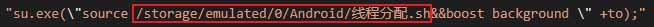

全局变量：background，把需要的软件加进去

适用情景：有的app，用起来的电流超级高，可以给它分配小核，这样使用可能有点卡，但是相对省电很多（也要分情况看什么app,有的只用小核，反而耗电量会增加）

其中，框住的地方就是你【线程分配.sh】的路径，可以自定义
Thanox（情景模式）

你可以修改boost background改成boost audio-app，进程就分配成audio-app的cpu了
  cpuset有top-app、background、foreground、restricted、system-background、audio-app等
Thanox（情景模式）

当你在全局变量添加的包名后，比如你添加了微信，那么你打开微信后，过了5秒后，就会变成你想要的background了。你可以把scene开启小窗模式，然后查看微信进程的cpuset。一般前台应用的命令行是/foreground，如果成功，/foreground会变成你想要的模式